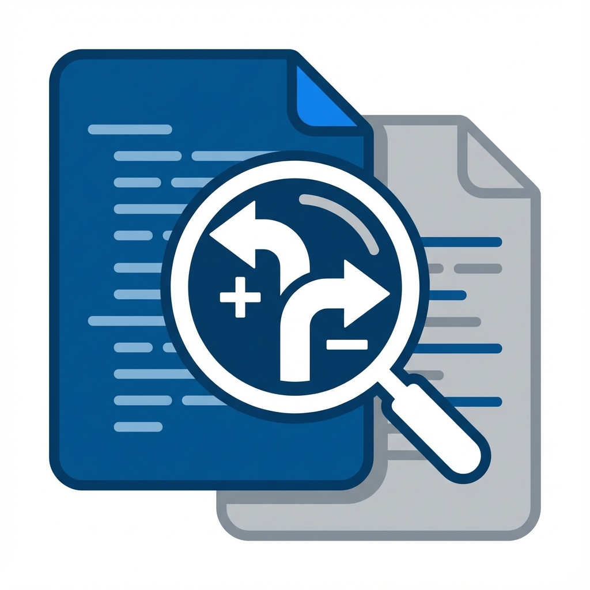

# OpenAPI Diff Tool

A powerful, GUI-based tool for comparing OpenAPI specifications (Swagger) and generating comprehensive reports (Synthesis, Analytical, Impact) in DOCX format.



## Features

*   **Deep Comparison**: Analyzes changes in Paths, Endpoints, Schemas, Parameters, and more.
*   **Smart Rename Detection**: Identifies renamed schemas to avoid false positives (Added/Removed).
*   **Multiple Report Types**:
    *   **Synthesis Report**: High-level summary of changes.
    *   **Analytical Report**: Detailed breakdown of every modification.
    *   **Impact Report**: Focuses on breaking changes and implementation details.
*   **Corporate Templating**: Fully customizable DOCX templates with variable substitution.
*   **User-Friendly GUI**: Native Windows interface with drag-and-drop support (via file browsing).
*   **Standalone Executable**: No Python installation required for end-users.

## What's New in v1.2
*   **Custom Extensions Support**: Full tracking and reporting of vendor-specific extensions (`x-`).
*   **Enhanced Media Type Comparison**: Now includes `examples` and `encoding` diffing.
*   **Visual Refinement**: Analytical reports now use dynamic table widths for perfect margin alignment and a cleaner labeling style.

## What's New in v1.1.1
*   **Affected Endpoints**: Analytic reports now trace schema changes to impacted endpoints.
*   **GUI Improvements**: Modernized interface and bug fixes.


## Installation

### For End Users
### For End Users
Simply download the latest release (`OpenAPIDiffTool.exe`) and run it.

> **Note**: If you see a **"Windows protected your PC"** message (SmartScreen):
> 1. Click **More info** (Ulteriori informazioni).
> 2. Click **Run anyway** (Esegui comunque).
> This happens because the application is an open-source tool and does not have a paid digital signature certificate. It is safe to run.

### For Developers

1.  Clone the repository:
    ```bash
    git clone https://github.com/yourusername/openapi-diff-tool.git
    cd openapi-diff-tool
    ```

2.  Install dependencies:
    ```bash
    pip install -r requirements.txt
    ```

3.  Run the application:
    ```bash
    python gui.py
    ```

## Usage

1.  **Select Specs**: Choose the Old and New OpenAPI YAML/JSON files.
2.  **Select Output**: Choose where to save the reports.
3.  **Configure**:
    *   Go to **File > Preferences** to set user variables (e.g., Company Name) and manage templates.
    *   Enable **Debug Mode** if you need detailed logs.
4.  **Generate**: Click **GENERATE REPORTS**.

## Building from Source

To create the standalone executable:

```bash
python build_exe.py
```

The output will be in the `dist/` folder.

## License

[MIT License](LICENSE)

## Project Documentation

For a detailed history of the project's development and verification:

*   [Task List](docs/context/task.md): Comprehensive list of all implemented features and tasks.
*   [Walkthrough](docs/context/walkthrough.md): Detailed verification scenarios and development log.
